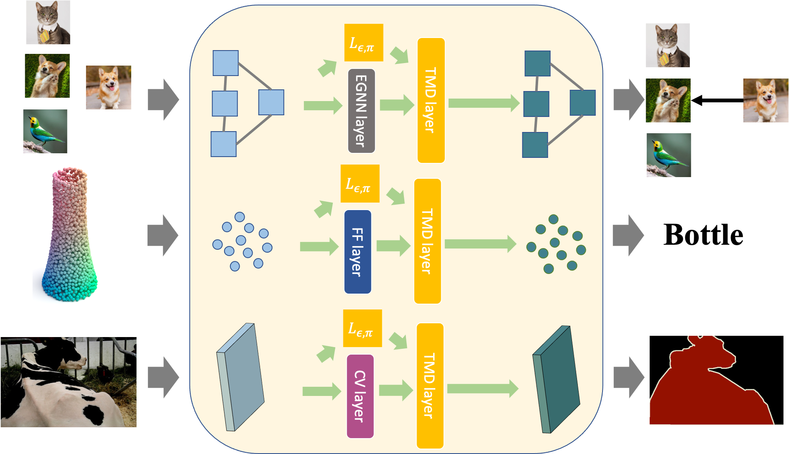

</img>

## TMD Layer

Implementation of TMD Layer, from the paper <a href="https://openaccess.thecvf.com/content/ICCV2021/papers/Meng_Neural_TMDlayer_Modeling_Instantaneous_Flow_of_Features_via_SDE_Generators_ICCV_2021_paper.pdf"> Neural TMDlayer: Modeling Instantaneous flow of features via SDE Generators (ICCV-2021 oral)</a>.

## Install

```bash
$ pip install tmd-layer
```

## Requirements
* Python 3
* Pytorch 1.5+

## Usage

This layer expects a tensor in the shape [b,n,d]

b - batch size (can be set to default one) <br/>
n - number of samples in one batch <br/>
d - dimension of input <br/>

To have a quick and easy understanding of our TMDlayer, you can take a look at the video on youtube: <a href="https://www.youtube.com/watch?v=vR3nrYJqcgQ">https://www.youtube.com/watch?v=vR3nrYJqcgQ</a>


<a href="https://github.com/zihangm/neural-tmd-layer">Look here for some implementations(https://github.com/zihangm/neural-tmd-layer)</a>


```python

import torch
from tmd_layer import TMDLayer

tmd_layer = TMDLayer(
    in_features = 28*28, # input feature dimension(d)
    L_latent = 16,       # latent dimension of tmd layer
    epsilon = 0.25       # epsilon(hyperparameter)
)


x = torch.randn(1, 100, 28*28) # [b,n,d] 

x = tmd_layer(x)

```


This repo uses the following implementation of pi(target) function

```python
nn.Sequential(
    nn.Linear(L_latent, in_features), 
    nn.ReLU(),
    nn.Linear(in_features, 1),
    nn.Sigmoid()
)
```


## Citations

```bibtex
@inproceedings{meng2021neural,
  title={Neural TMDlayer: Modeling Instantaneous flow of features via SDE Generators},
  author={Meng, Zihang and Singh, Vikas and Ravi, Sathya N},
  booktitle={Proceedings of the IEEE/CVF International Conference on Computer Vision},
  pages={11635--11644},
  year={2021}
}

```
